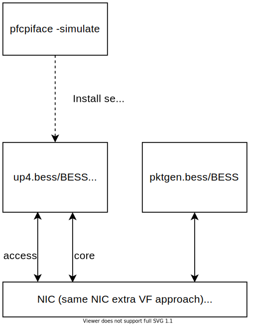

<!--
SPDX-License-Identifier: Apache-2.0
Copyright(c) 2019 Intel Corporation
-->

# UPF-EPC - Installation Instructions

## Pre-reqs

You need the following dependencies.

* Docker CE >= 19.03
* Linux kernel version >= 4.15 for Docker; >= 4.19 for AF_XDP
* Hugepages mounted at `/dev/hugepages` or updated location in [`docker_setup.sh`](docker_setup.sh)
* Update mode for devices: `dpdk`, `af_xdp` or `af_packet` in [`docker_setup.sh`](docker_setup.sh),
    along with device details
* Update [`docker_setup.sh`](docker_setup.sh) and [`conf/up4.bess`](conf/up4.bess) to run iltrafficgen tests
* Update [`docker_setup.sh`](docker_setup.sh) and [`conf/upf.json`](conf/upf.json) to run sim mode

>`docker_setup.sh` is a quick start guide to set up UPF-EPC for evaluation.

## Init

### ZMQ Streamer

UPF-EPC communicates with the CP via ZMQ. Please adjust
[`interface.cfg`](https://github.com/omec-project/ngic-rtc/tree/central-cp-multi-upfs/config/interface.cfg) accordingly.

### CP

Please refer to [INSTALL.md](https://github.com/omec-project/ngic-rtc/tree/central-cp-multi-upfs/INSTALL.MD) to get CP running.

### DP

| VAR            | DEFAULT    | NOTES                                              |
|----------------|------------|----------------------------------------------------|
| MAKEFLAGS      | -j$(nproc) | Customize if build fails due to memory exhaustion  |
| DOCKER_BUIDKIT |          1 | Turn off to try legacy builder on older Docker ver |

To run BESS daemon with NGIC modules' code:

```bash
./docker_setup.sh
```

To update the pipeline, reflect changes to [`conf/up4.bess`](conf/up4.bess)
and/or [`conf/upf.json`](conf/upf.json)

To display the pipeline, do:

```bash
docker exec bess ./bessctl show pipeline > pipeline.txt
```

## Operate DP Pipeline

Control program(s) to dynamically configure BESS modules

| Functionality | Controller |
|---------------|------------|
| Routes | [route_control.py](conf/route_control.py) |
| UE sessions | Static trafficgen only in `pfcpiface/main.go` |
| CP communication | [zmq-cpiface.cc](cpiface/zmq-cpiface.cc) |

## Testing

### Microbenchmarks

#### Simulation mode

UPF-EPC has a simulation mode that enables testing the pipeline on a single machine,
without the need for external interfaces.

> Note: This mode does not support multiple workers currently.


To start UPF-EPC in simulation mode:

1. Enable sim mode in configuration files

```patch
diff --git a/conf/upf.json b/conf/upf.json
index 15042f9..e5a4588 100644
--- a/conf/upf.json
+++ b/conf/upf.json
@@ -2,7 +2,7 @@
     "": "Vdev or sim support. Enable `\"mode\": \"af_xdp\"` to enable AF_XDP mode, or `\"mode\": \"af_packet\"` to enable AF_PACKET mode, or `\"mode\": \"sim\"` to generate synthetic traffic from BESS's Source module",
     "": "mode: af_xdp",
     "": "mode: af_packet",
-    "": "mode: sim",
+    "mode": "sim",

     "": "max UE sessions",
     "max_sessions": 50000,
diff --git a/docker_setup.sh b/docker_setup.sh
index 086ad2f..79d81bd 100755
--- a/docker_setup.sh
+++ b/docker_setup.sh
@@ -16,7 +16,7 @@ bessd_port=10514
 mode="dpdk"
 #mode="af_xdp"
 #mode="af_packet"
-#mode="sim"
+mode="sim"

 # Gateway interface(s)
 #
```

2. Start UPF

```bash
 ./docker_setup.sh
```


3. Insert rules into relevant PDR and FAR tables

    gRPC sim mode

    ```bash
    docker exec bess-pfcpiface pfcpiface -config /conf/upf.json -simulate create
    ```

    OR

    PFCP sim mode

    ```bash
    docker exec bess-pfcpiface pfcpiface -config /conf/upf.json -pfcpsim
    ```

4. (optional) [Observe DP pipeline](#observe-dp-pipeline)

#### [Pktgen](conf/pktgen.bess)

Pktgen allows us to test the upf pipeline with external fastpath interfaces.
This can be done either using a single machine or two machines



1. Configure the mode/cores/memory/devices as per your environment and start UPF

```bash
 ./docker_setup.sh
```

2. Insert rules into relevant PDR and FAR tables

```bash
docker exec bess-pfcpiface pfcpiface -config /conf/upf.json -simulate create
```

3. On the same machine using an extra VF or from a different machine run pktgen instance

```bash
docker run --name pktgen -td --restart unless-stopped \
           --cpuset-cpus=2-5 --ulimit memlock=-1 --cap-add IPC_LOCK \
           -v /dev/hugepages:/dev/hugepages -v "$PWD/conf":/opt/bess/bessctl/conf \
           --device=/dev/vfio/vfio --device=/dev/vfio/176 \
           upf-epc-bess:"$(<VERSION)" -grpc-url=0.0.0.0:10514
```

4. Customize [pktgen.bess](conf/pktgen.bess) to match [sim config](conf/upf.json) used in step 2

5. Start pktgen

```bash
docker exec -it pktgen ./bessctl run pktgen
```

## Observe DP Pipeline

To view the pipeline, open [http://[hostip]:8000](http://[hostip]:8000)
in a browser

To drop into BESS shell

```bash
docker exec -it bess bessctl
```

## Network Token Functions

OMEC includes a Network Token Function (NTF) which provides preliminary support
for Network Tokens, a new protocol to expose datapath services to end users and
application providers. More details are available at https://networktokens.org

In order to compile NTF support, run the following:

```bash
ENABLE_NTF=1 ./docker_setup.sh
```

Update [`conf/spgwu.json`](conf/spgwu.json) and set the `enable_ntf` option to
`true`.
