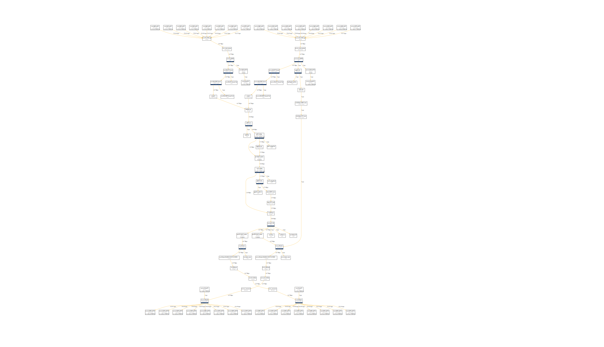

<!--
SPDX-License-Identifier: Apache-2.0
Copyright 2019 Intel Corporation
-->

# upf-epc

[](https://goreportcard.com/report/github.com/omec-project/upf-epc)

[](https://jenkins.onosproject.org/job/bess-upf-linerate-tests/)

## Overview

UPF-EPC is a revised version of [ngic-rtc](https://github.com/omec-project/ngic-rtc/tree/central-cp-multi-upfs)'s [dp](https://github.com/omec-project/ngic-rtc/tree/central-cp-multi-upfs/dp).
It works seamlessly with all NFs available in the omec-project's EPC. Like ngic-rtc's dp, it communicates with [cp](https://github.com/omec-project/ngic-rtc/tree/central-cp-multi-upfs/cp) and
conforms to Control User Plane Separated (CUPS) architecture. The prototype is based on the 3GPP TS23501 specifications of EPC and functions as a co-located Service
and Packet Gateway (SPGW-U). This branch is compatible with Aether's control plane.

The dataplane is built on top of [Berkeley Extensible Software Switch](https://github.com/NetSys/bess/) (BESS) programmable framework, where each submodule in the SPGW-U
pipeline is represented by a BESS-based module. As a result, the pipeline built using BESS can visually be interpreted as a directed acyclic graph, where
each module represents a graphical node. The revised dataplane is not just more flexible to use but also configurable and operator-friendly.

*Please see the ONFConnect 2019 [talk](https://www.youtube.com/watch?v=fqJGWcwcOxE) for more details. You can also see demo videos [here](https://www.youtube.com/watch?v=KxK64jalKHw) and [here](https://youtu.be/rWnZuJeUWi4).*

BESS tools are available out-of-the-box for debugging and/or monitoring; *e.g.*:

* Run `tcpdump` on arbitrary dataplane pipeline module

```bash
localhost:10514 $ tcpdump s1uFastBPF
  Running: tcpdump -r /tmp/tmpYUlLw8
reading from file /tmp/tmpYUlLw8, link-type EN10MB (Ethernet)
23:51:02.331926 STP 802.1s, Rapid STP, CIST Flags [Learn, Forward], length 102
tcpdump: pcap_loop: error reading dump file: Interrupted system call
localhost:10514 $ tcpdump s1uFastBPF
  Running: tcpdump -r /tmp/tmpUBTGau
reading from file /tmp/tmpUBTGau, link-type EN10MB (Ethernet)
00:03:02.286527 STP 802.1s, Rapid STP, CIST Flags [Learn, Forward], length 102
00:03:04.289155 STP 802.1s, Rapid STP, CIST Flags [Learn, Forward], length 102
00:03:06.282790 IP 0.0.0.0.bootpc > 255.255.255.255.bootps: BOOTP/DHCP, Request from 68:05:ca:37:e2:80 (oui Unknown), length 300
00:03:06.291918 STP 802.1s, Rapid STP, CIST Flags [Learn, Forward], length 102
00:03:07.175420 IP 0.0.0.0.bootpc > 255.255.255.255.bootps: BOOTP/DHCP, Request from 68:05:ca:37:d9:e0 (oui Unknown), length 300
00:03:07.489266 IP 0.0.0.0.bootpc > 255.255.255.255.bootps: BOOTP/DHCP, Request from 68:05:ca:37:d9:e1 (oui Unknown), length 300
00:03:08.130884 IP 0.0.0.0.bootpc > 255.255.255.255.bootps: BOOTP/DHCP, Request from 68:05:ca:37:e1:38 (oui Unknown), length 300
00:03:08.294573 STP 802.1s, Rapid STP, CIST Flags [Learn, Forward], length 102
00:03:10.247193 STP 802.1s, Rapid STP, CIST Flags [Learn, Forward], length 102
```

* Visualize your dataplane pipeline



## Demo

https://user-images.githubusercontent.com/6157640/133918985-c36d4668-4e98-4866-8526-fd7326a39931.mp4

[](http://www.youtube.com/watch?v=qNbNG9SXFn0 "5G UPF")

## Feature List

### Complete

* IPv4 support
* N3, N4, N6, N9 interfacing
* Single & Multi-port support
* Monitoring/Debugging capabilties using
    - tcpdump on individual BESS modules
    - visualization web interface
    - command line shell interface for displaying statistics
* Static IP routing
* Dynamic IP routing
* Support for IPv4 datagrams reassembly
* Support for IPv4 packets fragmentation
* Support for UE IP NAT
* Service Data Flow (SDF) configuration via N4/PFCP.
* I-UPF/A-UPF ULCL/Branching i.e., simultaneous N6/N9 support within PFCP session
* Downlink Data Notification (DDN) - notification only

### In Progress

* Usage Reporting Rules (URR)
* Application Detection and Control (ADC) configuration via N4/PFCP.

### Pending

* PCC (Policy Control and Charging) rules configuration.
* SDF and APN based Qos Metering for MBR.
* Sponsored Domain Name support
* Buffering of downlink data

## Installation

Please see [INSTALL.md](docs/INSTALL.md) for details on how to set up CP and UPF-EPC.
