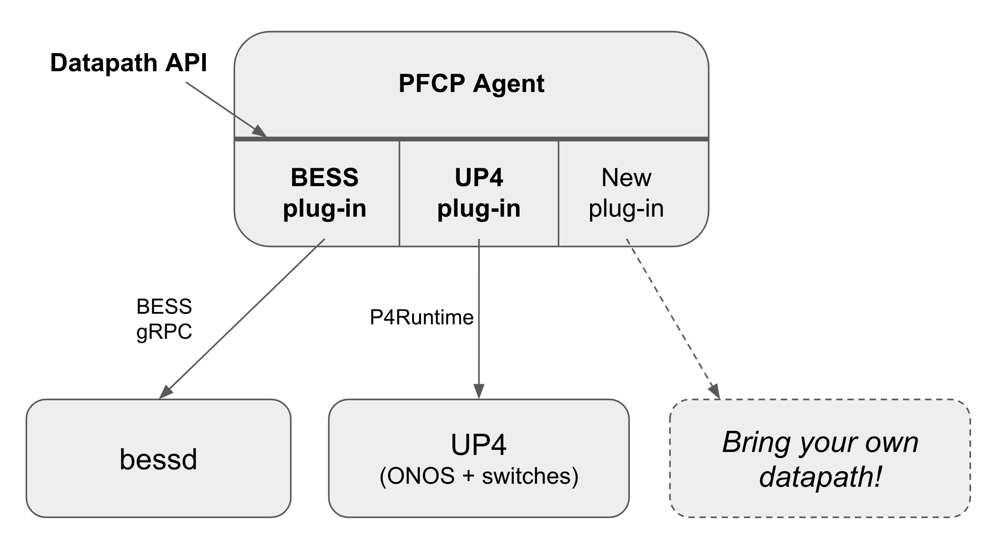

<!--
SPDX-License-Identifier: Apache-2.0
Copyright 2019 Intel Corporation
-->

# UPF

[](https://goreportcard.com/report/github.com/omec-project/upf)

[](https://jenkins.onosproject.org/job/bess-upf-linerate-tests/)

This project implements a 4G/5G User Plane Function (UPF) compliant with 3GPP
TS23.501. It follows the 3GPP Control and User Plane Separation (CUPS)
architecture, making use of the PFCP protocol for the communication between
SMF (5G) / SPGW-C (4G) and UPF.

This UPF implementation is actively used as part of the
[Aether platform](https://opennetworking.org/aether/) in conjunction with the
SD-Core mobile core control plane.

### Table Of Contents
  * [Overview](#overview)
  * [Feature List](#feature-list)
  * [Getting Started](#getting-started)
  * [Contributing](#contributing)
  * [Support](#support)
  * [License](#license)


## Overview

The UPF implementation consists of two layers:

- **PFCP Agent (_pfcpiface_)**: a Go-based implementation of the PFCP northbound API used to interact with the mobile core control plane.
- **Datapath:** responsible for the actual data plane packet processing.

The PFCP Agent implements datapath plugins that translate
  PFCP messages to datapath-specific configurations. We currently support two
  datapath implementations:
  - [BESS](https://github.com/omec-project/bess): a software-based datapath
    built on top of the Berkeley Extensible Software Switch (BESS) framework.
    For more details, please see the ONFConnect 2019 [talk](https://www.youtube.com/watch?v=fqJGWcwcOxE)
    and demo videos [here](https://www.youtube.com/watch?v=KxK64jalKHw) and
    [here](https://youtu.be/rWnZuJeUWi4).
    > Note: The source code for the BESS-based datapath is in https://github.com/omec-project/bess
  - [UP4](https://github.com/omec-project/up4): an implementation leveraging
    ONOS and P4-programmable switches to realize a hardware-based datapath.

The combination of PFCP Agent and UP4 is usually referred to as P4-UPF. While
BESS-UPF denotes the combination of PFCP Agent and the BESS datapath.

PFCP Agent internally abstracts different datapaths using a common API, while
the different plug-ins can use specific southbound protocols to communicate with
the different datapath instances. Support for new datapaths can be provided by
implementing new plugins.



This repository provides code to build two Docker images: `pfcpiface` (the PFCP
Agent) and `bess` (the BESS-based datapath).

To build all Docker images run:

```
make docker-build
```

To build a selected image use `DOCKER_TARGETS`:

```
DOCKER_TARGETS=pfcpiface make docker-build
```

The latest Docker images are also published in the OMEC project's DockerHub
registry: [upf-epc-bess](https://hub.docker.com/r/omecproject/upf-epc-bess),
[upf-epc-pfcpiface](https://hub.docker.com/r/omecproject/upf-epc-pfcpiface).

### BESS-UPF Components


### Zoom-in


## Feature List

### PFCP Agent
* PFCP Association Setup/Release and Heartbeats
* Session Establishment/Modification with support for PFCP entities such as
  Packet Detection Rules (PDRs), Forwarding Action Rules (FARs), QoS Enforcement
  Rules (QERs).
* UPF-initiated PFCP association
* UPF-based UE IP address assignment
* Application filtering using SDF filters
* Generation of End Marker Packets
* Downlink Data Notification (DDN) using PFCP Session Report
* Integration with Prometheus for exporting PFCP and data plane-level metrics.
* Application filtering using application PFDs (_**experimental**_).

### BESS-UPF
* IPv4 support
* N3, N4, N6, N9 interfacing
* Single & Multi-port support
* Monitoring/Debugging capabilities using
  - tcpdump on individual BESS modules
  - visualization web interface
  - command line shell interface for displaying statistics
* Static IP routing
* Dynamic IP routing
* Support for IPv4 datagrams reassembly
* Support for IPv4 packets fragmentation
* Support for UE IP NAT
* Service Data Flow (SDF) configuration via N4/PFCP
* I-UPF/A-UPF ULCL/Branching i.e., simultaneous N6/N9 support within PFCP session
* Downlink Data Notification (DDN) - notification only (no buffering)
* Basic QoS support, with per-slice and per-session rate limiting
* Per-flow latency and throughput metrics
* DSCP marking of GTPu packets by copying the DSCP value from the inner IP packet
* Network Token Functions (_**experimental**_)
* Support for DPDK, CNDP

### P4-UPF
P4-UPF implements a core set of features capable of supporting requirements for
a broad range of enterprise use cases.

See the [ONF's blog post](https://opennetworking.org/news-and-events/blog/using-p4-and-programmable-switches-to-implement-a-4g-5g-upf-in-aether/)
for an overview of P4-UPF. Additionally, refer to the [SD-Fabric documentation](https://docs.sd-fabric.org/master/advanced/p4-upf.html)
for the detailed feature set.

## Getting started

### Installation

Please see installation document [here](docs/INSTALL.md) for details on how to
set up the PFCP Agent with BESS-UPF.

To install the PFCP Agent with UP4 please follow the [SD-Fabric documentation](https://docs.sd-fabric.org/master/index.html).

### Configuration

Please see the configuration guide [here](docs/configuration-guide.md) to learn
more about the different configurations.

### Testing

The UPF project currently implements three types of tests:
  - Unit tests
  - E2E integration tests
  - PTF tests for BESS-UPF

**Unit tests** for the PFCP Agent's code. To run unit tests use:

```
make test
```

**E2E integration tests** that verify the inter-working between the PFCP Agent
and a datapath.

We provide two modes of E2E integration tests: `native` and `docker`.

The `native` mode invokes Go objects directly from the `go test` framework, thus
it makes the test cases easier to debug. To run E2E integration tests for
BESS-UPF in the `native` mode use:

```
make test-bess-integration-native
```

The `docker` mode uses fully containerized environment and runs all components
(the PFCP Agent and a datapath mock) as Docker containers. It ensures the
correct behavior of the package produced by the UPF project. To run E2E
integration tests for UP4 in the `docker` mode use:

```
make test-up4-integration-docker
```

> NOTE: The `docker` mode for BESS-UPF and the `native` mode for UP4 are not implemented yet.

**PTF tests for BESS-UPF** verify the BESS-based implementation of the UPF
datapath (data plane). Details to run PTF tests for BESS-UPF can be found [here](./ptf/README.md).

## Contributing

The UPF project welcomes new contributors. Feel free to propose a new feature,
integrate a new UPF datapath or fix bugs!

Before contributing, please follow these guidelines:

* Check out [open issues](https://github.com/omec-project/upf/issues).
* Check out [the developer guide](./docs/developer-guide.md).
* We follow the best practices described in https://google.github.io/eng-practices/review/developer/.
  Get familiar with them before submitting a PR.
* Both unit and E2E integration tests must pass on CI. Please make sure that
  tests are passing with your change (see [Testing](#testing) section).

## Support

To report any other kind of problem, feel free to open a GitHub Issue or reach
out to the project maintainers on the ONF Community Slack ([aether-dev](https://app.slack.com/client/T095Z193Q/C01E4HMLBNV)).

## License

The project is licensed under the [Apache License, version 2.0](./LICENSES/Apache-2.0.txt).
