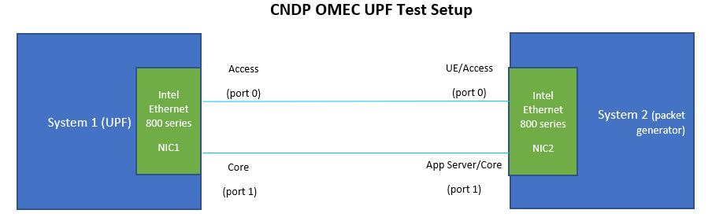

<!--
SPDX-License-Identifier: Apache-2.0
Copyright 2020 Intel Corporation
-->

# **Cloud Native Data Plane (CNDP)**

Cloud Native Data Plane (CNDP) is a collection of user space libraries for accelerating packet processing for cloud applications. It aims to provide better performance than that of standard network socket interfaces by using an I/O layer primarily built on AF_XDP, an interface that delivers packets directly to user space, bypassing the kernel networking stack. For more details refer https://cndp.io/

CNDP BESS port enables sending/receiving packets to/from network interface using AF-XDP.  CNDP integration with OMEC BESS UPF enables a software-based datapath and also provides deployment flexibility for kubernetes based deployments where CNDP uses [AF-XDP device plugin](https://github.com/intel/afxdp-plugins-for-kubernetes).

### Table Of Contents
  * [Step 1: Build the OMEC UPF docker container](#step-1-build-the-omec-upf-docker-container)
  * [Step 2: Test setup](#step-2-test-setup)
  * [Step 3: Run UPF in System 1](#step-3-run-upf-in-system-1)
  * [Step 4: Run DPDK packet generator in System 2](#step-4-run-dpdk-packet-generator-in-system-2)
  * [CNDP OMEC UPF multiple worker threads setup](#cndp-omec-upf-multiple-worker-threads-setup)

Following are the steps required to build and test CNDP BESS UPF docker image:

## Step 1: Build the OMEC UPF docker container

> Note: If you are behind a proxy make sure to export/setenv http_proxy and https_proxy

From the top level directory call:

```
$ make docker-build
```

## Step 2: Test setup

Following diagram shows is a test setup. 



There are two systems: System 1 runs CNDP BESS UPF and System 2 runs DPDK based packet generator which simulates traffic generated from multiple UEs and App servers.

Install NIC driver version 1.9.11 in System 1 from this link: https://www.intel.com/content/www/us/en/download/19630/738725/intel-network-adapter-driver-for-e810-series-devices-under-linux.html. This driver is used instead of in-tree kernel driver since this driver supports tc filter for creating queue groups and RSS for GTPU packet traffic steering. We need to compile and install this driver in your system with ADQ (Application Device Queues). As mentioned in the NIC driver README, use the following command to install the NIC driver.
```
$ sudo make -j CFLAGS_EXTRA='-DADQ_PERF_COUNTERS' install
```

Load the installed ice driver

```
sudo rmmod ice
sudo modprobe ice
```

The setup uses Physical Function (PF) of PCIe network adaptor (where the driver supports AF-XDP zero copy ) for improved network I/O performance. AF-XDP zero copy support for SR-IOV driver and sub function support using devlink will be supported in future releases.

System 1 and System 2 are connected using  physical links. Setup uses two network ports which represents access and core interface. This test setup uses Intel Ethernet 800 series network adapter (hereafter referred to as NIC).  NIC in System 1 has Intel Dynamics Device Personalization (DDP) for telecommunications workload enabled. DDP profile can help in GTPU packet traffic steering to required NIC hardware queues using RSS (Receive Side Scaling). DDP feature works along with XDP offload feature in NIC hardware to redirect GTPU packets directly to user space via AF-XDP sockets. Refer the Deployment section in this [document](https://builders.intel.com/docs/networkbuilders/intel-ethernet-controller-800-series-device-personalization-ddp-for-telecommunications-workloads-technology-guide.pdf) to enable DDP. Please follow Intel ethernet controller E810 DDP for telecommunications technology guide.

## Step 3: Run UPF in System 1

1) Setup hugepages in the system 1. The dpdk-hugepages script from DPDK is used for this purpose. To get a copy of it,
execute the following command from the UPF's root directory:
```
$ wget https://raw.githubusercontent.com/DPDK/dpdk/main/usertools/dpdk-hugepages.py -O dpdk-hugepages.py
$ chmod +x dpdk-hugepages.py
```
For example, to setup 8GB of total huge pages (8 pages each of size 1GB in each NUMA node) using DPDK script, use the command `dpdk-hugepages.py -p 1G --setup 8G`

2) Enable cndp mode, use appropriate netdev interface and uncomment jsonc config file in configuration file  [upf.json](../conf/upf.json)

```
diff --git a/conf/upf.json b/conf/upf.json
index 62fa435..169dc5a 100644
--- a/conf/upf.json
+++ b/conf/upf.json
@@ -3,8 +3,8 @@
     "": "mode: af_xdp",
     "": "mode: af_packet",
     "": "mode: sim",
-    "": "mode: cndp",
-    "mode": "dpdk",
+    "": "mode: dpdk",
+    "mode": "cndp",

     "table_sizes": {
         "": "Example sizes based on sim mode and 50K sessions. Customize as per your control plane",
@@ -62,14 +62,14 @@

     "": "Gateway interfaces",
     "access": {
-        "ifname": "ens803f2",
-        "": "cndp_jsonc_file: conf/cndp_upf_1worker.jsonc"
+        "ifname": "enp134s0",
+        "cndp_jsonc_file": "conf/cndp_upf_1worker.jsonc"
     },

     "": "UE IP Natting. Update the line below to `\"ip_masquerade\": \"<ip> [or <ip>]\"` to enable",
     "core": {
-        "ifname": "ens803f3",
-        "": "cndp_jsonc_file: conf/cndp_upf_1worker.jsonc",
+        "ifname": "enp136s0",
+        "cndp_jsonc_file": "conf/cndp_upf_1worker.jsonc",
         "": "ip_masquerade: 18.0.0.1 or 18.0.0.2 or 18.0.0.3"
     },
```

3) Enable cndp mode in script file  [docker_setup.sh](../scripts/docker_setup.sh)

```
diff --git a/scripts/docker_setup.sh b/scripts/docker_setup.sh
index 7aff6a6..1a8e2fd 100755
--- a/scripts/docker_setup.sh
+++ b/scripts/docker_setup.sh
@@ -15,8 +15,8 @@ metrics_port=8080
 # "af_packet" uses AF_PACKET sockets via DPDK's vdev for pkt I/O.
 # "sim" uses Source() modules to simulate traffic generation
 # "cndp" use kernel AF-XDP. It supports ZC and XDP offload if driver and NIC supports it. It's tested on Intel 800 series n/w adapter.
-mode="dpdk"
-#mode="cndp"
+#mode="dpdk"
+mode="cndp"
 #mode="af_xdp"
 #mode="af_packet"
 #mode="sim"
```

4) Modify [cndp_upf_1worker.jsonc](../conf/cndp_upf_1worker.jsonc) file lports section to update the access and core netdev interface name and required queue id.

```
diff --git a/conf/cndp_upf_1worker.jsonc b/conf/cndp_upf_1worker.jsonc
index 5c2fdaf..8d7b8da 100644
--- a/conf/cndp_upf_1worker.jsonc
+++ b/conf/cndp_upf_1worker.jsonc
@@ -84,9 +84,9 @@
     //    description   - (O) The description, 'desc' can be used as well
     // CNDP lports for Access network followed by lports for Core network.
     "lports": {
-        "enp134s0:0": {
+        "ens803f2:0": {
             "pmd": "net_af_xdp",
-            "qid": 22,
+            "qid": 10,
             "umem": "umem0",
             "region": 0,
             "busy_poll": true,
@@ -94,9 +94,9 @@
             "busy_timeout": 20,
             "description": "Access LAN 0 port"
         },
-        "enp136s0:0": {
+        "ens803f3:0": {
             "pmd": "net_af_xdp",
-            "qid": 22,
+            "qid": 10,
             "umem": "umem0",
             "region": 1,
             "busy_poll": true,
```

5) Modify the script [docker_setup.sh](../scripts/docker_setup.sh) and update the access and core interface names (s1u, sgi), access/core interface mac addresses and neighbor gateway interfaces mac addresses. This should match the access/core netdev interface name used in jsonc file in previous step. In our example test setup, neighbor mac address (n-s1u, n-sgi) corresponds to access/core interfaces used by packet generator in system 2 to send/receive n/w packets. Update following values based on your system configuration.

```
diff --git a/scripts/docker_setup.sh b/scripts/docker_setup.sh
index 7aff6a6..09d640b 100755
--- a/scripts/docker_setup.sh
+++ b/scripts/docker_setup.sh
@@ -24,7 +24,7 @@ mode="dpdk"
 # Gateway interface(s)
 #
 # In the order of ("s1u" "sgi")
-ifaces=("ens803f2" "ens803f3")
+ifaces=("enp134s0" "enp136s0")

 # Static IP addresses of gateway interface(s) in cidr format
 #
@@ -34,7 +34,7 @@ ipaddrs=(198.18.0.1/30 198.19.0.1/30)
 # MAC addresses of gateway interface(s)
 #
 # In the order of (s1u sgi)
-macaddrs=(9e:b2:d3:34:ab:27 c2:9c:55:d4:8a:f6)
+macaddrs=(40:a6:b7:78:3f:ec 40:a6:b7:78:3f:e8)

 # Static IP addresses of the neighbors of gateway interface(s)
 #
@@ -44,7 +44,7 @@ nhipaddrs=(198.18.0.2 198.19.0.2)
 # Static MAC addresses of the neighbors of gateway interface(s)
 #
 # In the order of (n-s1u n-sgi)
-nhmacaddrs=(22:53:7a:15:58:50 22:53:7a:15:58:50)
+nhmacaddrs=(40:a6:b7:78:3f:bc 40:a6:b7:78:3f:b8)
```

6) Modify the script [docker_setup.sh](../scripts/docker_setup.sh) and update the function `move_ifaces()` in condition `if [ "$mode" == 'cndp' ]`. Update `start_q_idx` to choose the start queue index to receive n/w packets. This should match the queue id used in lports section of [cndp_upf_1worker.jsonc](../conf/cndp_upf_1worker.jsonc). To get better performance (optional step), assign `cpuset-cpus` in [docker_setup.sh](../scripts/docker_setup.sh) to cores ids same as queue ids used to receive n/w packets.

```
diff --git a/conf/cndp_upf_1worker.jsonc b/conf/cndp_upf_1worker.jsonc
index da60d51..b1c3df6 100644
--- a/conf/cndp_upf_1worker.jsonc
+++ b/conf/cndp_upf_1worker.jsonc
@@ -86,7 +86,7 @@
     "lports": {
         "ens803f2:0": {
             "pmd": "net_af_xdp",
-            "qid": 22,
+            "qid": 10,
             "umem": "umem0",
             "region": 0,
             "busy_poll": true,
@@ -96,7 +96,7 @@
         },
         "ens803f3:0": {
             "pmd": "net_af_xdp",
-            "qid": 22,
+            "qid": 10,
             "umem": "umem0",
             "region": 1,
             "busy_poll": true,
```

```
diff --git a/scripts/docker_setup.sh b/scripts/docker_setup.sh
index 9058839..2e4e505 100755
--- a/scripts/docker_setup.sh
+++ b/scripts/docker_setup.sh
@@ -104,7 +104,7 @@ function move_ifaces() {
                        # num queues
                        num_q=1
                        # start queue index
-                       start_q_idx=22
+                       start_q_idx=10
                        # RSS using TC filter
                        setup_tc "${ifaces[$i]}" $num_q $start_q_idx
                fi
@@ -218,7 +218,7 @@ fi
 # Run bessd
 docker run --name bess -td --restart unless-stopped \
-       --cpuset-cpus=12-13 \
+       --cpuset-cpus=10-11 \
        --ulimit memlock=-1 -v /dev/hugepages:/dev/hugepages \
        -v "$PWD/conf":/opt/bess/bessctl/conf \
        --net container:pause \

```

7) Modify the script [reset_upf.sh](../scripts/reset_upf.sh) to use appropriate PCIe device address, network interface name and set_irq_affinity script in NIC driver.

```
diff --git a/scripts/reset_upf.sh b/scripts/reset_upf.sh
index ca90130..202049d 100755
--- a/scripts/reset_upf.sh
+++ b/scripts/reset_upf.sh
@@ -8,13 +8,13 @@ MODE=${1:-cndp}

 BUSY_POLL=${2:-true}

-ACCESS_PCIE=0000:86:00.0
-CORE_PCIE=0000:88:00.0
+ACCESS_PCIE=0000:84:00.0
+CORE_PCIE=0000:85:00.0

-ACCESS_IFACE=enp134s0
-CORE_IFACE=enp136s0
+ACCESS_IFACE=ens803f2
+CORE_IFACE=ens803f3

-SET_IRQ_AFFINITY=~/nic/driver/ice-1.9.7/scripts/set_irq_affinity
+SET_IRQ_AFFINITY=~/nic/driver/ice-1.9.11/scripts/set_irq_affinity

 sudo dpdk-devbind.py -u $ACCESS_PCIE --force
 sudo dpdk-devbind.py -u $CORE_PCIE --force
```

This script is used to stop any running containers, disable irqbalance, set irq affinity to all queues for access and core interface. The script also set XDP socket busy poll settings for access and core interfaces. `set_irq_affinity` script used by this script can be found in the NIC driver install path. irq affinity and AF_XDP busypoll settings are done to get improved network I/O performance. These settings are recommended but not mandatory.

8) From the top level directory call:

```
$ ./scripts/reset_upf.sh
$ ./scripts/docker_setup.sh
```
Note: The script [reset_upf.sh](../scripts/reset_upf.sh) needs to be executed once before running [docker_setup.sh](../scripts/docker_setup.sh). After that we can execute [docker_setup.sh](../scripts/docker_setup.sh) multiple times if required. The script [reset_upf.sh](../scripts/reset_upf.sh) uses dpdk-devbind script from DPDK. To get a copy of it, execute the following command from the UPF's root directory:

```
$ wget https://raw.githubusercontent.com/DPDK/dpdk/main/usertools/dpdk-devbind.py -O dpdk-devbind.py
$ chmod +x dpdk-devbind.py
```

Insert rules into relevant PDR and FAR tables

```
$ docker exec bess-pfcpiface pfcpiface -config /conf/upf.json -simulate create
```
9) From browser, use localhost:8000 to view the UPF pipeline in GUI. If you are remotely connecting to system via ssh, you need to setup a tunnel with local port forwarding.

10) To stop the containers run following command

```
./scripts/reset_upf.sh
```

## Step 4: Run DPDK packet generator in System 2

Build UPF docker image in System 2. Note: If you are behind a proxy make sure to export/setenv http_proxy and https_proxy
From the top level directory call:

```
$ make docker-build
```
From system 2, bind the two interfaces used by pktgen to DPDK (used to send n/w packets to access/core ). Also setup huge pages in the system.

[pktgen_cndp.bess](../conf/pktgen_cndp.bess) script is used for generating n/w traffic using DPDK pktgen for CNDP test setup. Modify [pktgen_cndp.bess](../conf/pktgen_cndp.bess) script as follows.

1) Update source and destination interface mac addresses of the access and core interface - smac_access, smac_core, dmac_access, dmac_core. Here smac_xxx corresponds to mac address of NIC in system 2 where we run pktgen and dst_xxx corresponds to mac address of NIC in system 1 which runs UPF pipeline.

2) Update worker core ids to use core id in NUMA node where NIC is attached. For example if NIC is attached to NUMA node 1, use worker core ids in NUMA node 1. For example, `workers=[22, 23, 24, 25]`

3) Bind the NICs to DPDK and note the vfio device number in "/dev/vfio"

From the top level directory call: (**Note**: Update below command to set `cpuset-cpus`range same as worker core ids in step 2 above and use the vfio device number from step 3)

```
docker run --name pktgen -td --restart unless-stopped \
        --cpuset-cpus=22-25 --ulimit memlock=-1 --cap-add IPC_LOCK \
        -v /dev/hugepages:/dev/hugepages -v "$PWD/conf":/opt/bess/bessctl/conf \
        -v /lib/firmware/intel:/lib/firmware/intel \
        --device=/dev/vfio/vfio --device=/dev/vfio/119 --device=/dev/vfio/120 \
        upf-epc-bess:"$(<VERSION)" -grpc-url=0.0.0.0:10514

docker exec -it pktgen ./bessctl run pktgen_cndp
```

We can monitor if pktgen is sending packets using the following command:

```
docker exec -it pktgen ./bessctl monitor tc
```

If we need to stop sending packets at some point use the following command:

```
docker exec -it pktgen ./bessctl daemon reset
```

## CNDP OMEC UPF multiple worker threads setup

Modify OMEC UPF and CNDP configuration files to support multiple worker threads. Each thread will run UPF pipeline in a different core.

To test multiple worker thread, we need to use CNDP jsonc file with appropriate configuration. An example CNDP jsonc file for 4 worker threads is in [cndp_upf_4worker.jsonc](../conf/cndp_upf_4worker.jsonc). Follow below steps to configure OMEC-UPF pipeline using 4 worker threads which runs on 5 cores (4 BESS worker threads and 1 main thread).

1) Update [upf.json](../conf/upf.json) to set number if worker threads as 4. Also use appropriate CNDP jsonc file with required number of lports (netdev/qid pair)

```
diff --git a/conf/upf.json b/conf/upf.json
index 37447b7..3bb3c27 100644
--- a/conf/upf.json
+++ b/conf/upf.json
@@ -63,18 +63,18 @@
     "": "Gateway interfaces",
     "access": {
         "ifname": "ens803f2",
-        "": "cndp_jsonc_file: conf/cndp_upf_1worker.jsonc"
+        "cndp_jsonc_file": "conf/cndp_upf_4worker.jsonc"
     },

     "": "UE IP Natting. Update the line below to `\"ip_masquerade\": \"<ip> [or <ip>]\"` to enable",
     "core": {
         "ifname": "ens803f3",
-        "": "cndp_jsonc_file: conf/cndp_upf_1worker.jsonc",
+        "cndp_jsonc_file": "conf/cndp_upf_4worker.jsonc",
         "": "ip_masquerade: 18.0.0.1 or 18.0.0.2 or 18.0.0.3"
     },

     "": "Number of worker threads. Default: 1",
-    "workers": 1,
+    "workers": 4,

     "": "Parameters for handling outgoing requests",
     "max_req_retries": 5,

```

2) Modify the script [docker_setup.sh](../scripts/docker_setup.sh) and update the function `move_ifaces()` in condition `if [ "$mode" == 'cndp' ]`.

Update `num_q` value same as number of worker threads (should be a power of 2). Update `start_q_idx` to choose the start queue index to receive n/w packets.
Note: Choose `start_q_idx` value greater than `num_q`. For example if `num_q` is 4, then keep `start_q_idx` > 4. This restriction comes with the current SW and HW limitations of having to share a RSS lookup table for all the queue sets. We can have only one queue set with non power of 2 queue count and that should be the max queue count of all the queue sets. For OMEC-UPF, we use two queue sets - Set 0 and Set 1. Set 1 will be used for handling data packets (GTPU encapsulated traffic in N3 access and N9 core interface, unencapsulated traffic in N6 core interface). Set 0 will be used to handle rest of the traffic not belonging to Set 1.

Assign 5 cores (4 worker thread, 1 main thread) to run BESS UPF pipeline. To get better performance (optional step), assign `cpuset-cpus` to cores ids same as queue ids used to receive n/w packets.

```
diff --git a/scripts/docker_setup.sh b/scripts/docker_setup.sh
index 9058839..7b4ef76 100755
--- a/scripts/docker_setup.sh
+++ b/scripts/docker_setup.sh
@@ -102,9 +102,9 @@ function move_ifaces() {
                fi
                if [ "$mode" == 'cndp' ]; then
                        # num queues
-                       num_q=1
+                       num_q=4
                        # start queue index
-                       start_q_idx=22
+                       start_q_idx=10
                        # RSS using TC filter
                        setup_tc "${ifaces[$i]}" $num_q $start_q_idx
                fi
@@ -218,7 +218,7 @@ fi
 # Run bessd
 docker run --name bess -td --restart unless-stopped \
-       --cpuset-cpus=12-13 \
+       --cpuset-cpus=10-14 \
        --ulimit memlock=-1 -v /dev/hugepages:/dev/hugepages \
        -v "$PWD/conf":/opt/bess/bessctl/conf \
        --net container:pause \
```

3) From the top level directory call:
```
$ ./scripts/reset_upf.sh
$ ./scripts/docker_setup.sh
```
Insert rules into relevant PDR and FAR tables
```
$ docker exec bess-pfcpiface pfcpiface -config /conf/upf.json -simulate create
```
4) From browser, use localhost:8000 to view the UPF pipeline in GUI. If you are remotely connecting to system via ssh, you need to setup a tunnel with local port forwarding.
