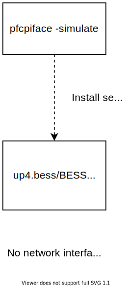

<!--
SPDX-License-Identifier: Apache-2.0
Copyright 2019 Intel Corporation
-->

# UPF: Installation Instructions

### Table Of Contents
  * [Prerequisites](#prerequisites)
  * [Configuration: Simulation mode](#configuration-simulation-mode)
  * [Configuration: DPDK mode](#configuration-dpdk-mode)
  * [Configuration: CNDP mode](#configuration-cndp-mode)
  * [Installation](#installation)
  * [General Execution Commands](#general-execution-commands)
  * [Testing (Microbenchmarks)](#testing-microbenchmarks)
  * [Troubleshooting](#troubleshooting)
  * [Network Token Functions](#network-token-functions)

## Prerequisites

You need the following dependencies.

* Docker CE >= 19.03
  - [Here](https://docs.docker.com/engine/install/ubuntu/) are the installation
    instructions on Ubuntu, or find the installation instructions for the Linux
    flavor you are using
* Linux kernel version >= 4.15 for Docker; >= 4.19 for AF_XDP
  - Type `uname -r` in the terminal to verify the kernel version
* Enable virtualization in the BIOS
* HugePages mounted at `/dev/hugepages` or updated location in [`scripts/docker_setup.sh`](../scripts/docker_setup.sh)
  - Reserve 1G HugePages and disable Transparent HugePages by setting:
    `default_hugepagesz=1G hugepagesz=1G hugepages=<# of hugepages> transparent_hugepage=never`,
    where <# of hugepages> = 2 x number of BESS UPF instances
  - To make this change permanent, do the following:
    ```
    sudo vim /etc/default/grub
	GRUB_CMDLINE_LINUX="intel_iommu=on iommu=pt default_hugepagesz=1G hugepagesz=1G hugepages=2 transparent_hugepage=never"

    sudo update-grub
    ```
* Update mode for devices: `dpdk`, `af_xdp` or `af_packet` in [`scripts/docker_setup.sh`](../scripts/docker_setup.sh), along with device details
  - If planning to use DPDK, the [Configuration: DPDK mode](#configuration-dpdk-mode) section provides all the details


## Configuration: Simulation mode

The simulation mode is a good way to explore the UPF functionalities
without the need for configuring DPDK and other hardware-related aspects. For
specifics on what can be customized, the user may refer to the UPF's config file
[here](./../conf/upf.json), where it is possible to modify/set different
parameters such as tables sizes, maximum number of flows, enable/disable
measurements, among several others.

To configure/install the UPF in simulation mode, the following changes are
required:

1. Enable sim mode in configuration file

    ```patch
    diff --git a/conf/upf.json b/conf/upf.json
    index c6531cc..928a503 100644
    --- a/conf/upf.json
    +++ b/conf/upf.json
    @@ -2,8 +2,8 @@
         "": "Vdev or sim support. Enable `\"mode\": \"af_xdp\"` to enable AF_XDP mode, or `\"mode\": \"af_packet\"` to enable AF_PACKET mode, `\"mode\": \"sim\"` to generate synthetic traffic from BESS's Source module or \"mode\": \"\" when running with UP4",
         "": "mode: af_xdp",
         "": "mode: af_packet",
    -    "": "mode: sim",
    -    "mode": "dpdk",
    +    "mode": "sim",
    +    "": "mode: dpdk",

         "table_sizes": {
             "": "Example sizes based on sim mode and 50K sessions. Customize as per your control plane",
    ```

2. Enable sim mode in script file
    ```patch
    diff --git a/scripts/docker_setup.sh b/scripts/docker_setup.sh
    index f5946c1..0a7b937 100755
    --- a/scripts/docker_setup.sh
    +++ b/scripts/docker_setup.sh
    @@ -14,10 +14,10 @@ metrics_port=8080
     # "af_xdp" uses AF_XDP sockets via DPDK's vdev for pkt I/O. This version is non-zc version. ZC version still needs to be evaluated.
     # "af_packet" uses AF_PACKET sockets via DPDK's vdev for pkt I/O.
     # "sim" uses Source() modules to simulate traffic generation
    -mode="dpdk"
    +#mode="dpdk"
     #mode="af_xdp"
     #mode="af_packet"
    -#mode="sim"
    +mode="sim"

     # Gateway interface(s)
     #
    ```


## Configuration: DPDK mode

To configure/install the UPF in DPDK mode, the following changes are required:

1. Follow the directions [here](dpdk-configuration.md) to get details about MAC
   addresses, VFIO groups, and others. This information is used in the next step.

2. Update parameters in script file

    ```patch
    $ git diff scripts/docker_setup.sh
    diff --git a/scripts/docker_setup.sh b/scripts/docker_setup.sh
    index f5946c1..6c0f009 100755
    --- a/scripts/docker_setup.sh
    +++ b/scripts/docker_setup.sh
    @@ -32,7 +32,7 @@ ipaddrs=(198.18.0.1/30 198.19.0.1/30)
     # MAC addresses of gateway interface(s)
     #
     # In the order of (s1u sgi)
    -macaddrs=(9e:b2:d3:34:ab:27 c2:9c:55:d4:8a:f6)
    +macaddrs=(b4:96:91:b1:ff:f0 b4:96:91:b1:ff:f1)

     # Static IP addresses of the neighbors of gateway interface(s)
     #
    @@ -42,7 +42,7 @@ nhipaddrs=(198.18.0.2 198.19.0.2)
     # Static MAC addresses of the neighbors of gateway interface(s)
     #
     # In the order of (n-s1u n-sgi)
    -nhmacaddrs=(22:53:7a:15:58:50 22:53:7a:15:58:50)
    +nhmacaddrs=(b4:96:91:b4:47:b8 b4:96:91:b4:47:b9)

     # IPv4 route table entries in cidr format per port
     #
    @@ -111,7 +111,7 @@ sudo rm -rf /var/run/netns/pause
     make docker-build

     if [ "$mode" == 'dpdk' ]; then
    -       DEVICES=${DEVICES:-'--device=/dev/vfio/48 --device=/dev/vfio/49 --device=/dev/vfio/vfio'}
    +       DEVICES=${DEVICES:-'--device=/dev/vfio/184 --device=/dev/vfio/185 --device=/dev/vfio/vfio'}
        PRIVS='--cap-add IPC_LOCK'

     elif [ "$mode" == 'af_xdp' ]; then
    ```

3. If testing with Intel 800 series network adapter (for example, E810 NIC) with DDP (Dynamic Device Personalization) enabled for GTPU, update the script file

   ```
   $ git diff scripts/docker_setup.sh
   diff --git a/scripts/docker_setup.sh b/scripts/docker_setup.sh
   index 7aff6a6..c5afb42 100755
   --- a/scripts/docker_setup.sh
   +++ b/scripts/docker_setup.sh
   @@ -218,6 +218,7 @@ fi
    docker run --name bess -td --restart unless-stopped \
           --cpuset-cpus=12-13 \
           --ulimit memlock=-1 -v /dev/hugepages:/dev/hugepages \
   +       -v /lib/firmware/intel:/lib/firmware/intel \
           -v "$PWD/conf":/opt/bess/bessctl/conf \
           --net container:pause \
           $PRIVS \
   ```

## Configuration: CNDP mode

To configure/install the UPF in CNDP mode, please refer [CNDP_README.md](./CNDP_README.md)


## Installation

1. Start installation from UPF's root directory

    ```bash
    ./scripts/docker_setup.sh
    ```

    > **_NOTE:_** By default, docker_startup.sh uses/sets 2 CPUs for the BESS
      container (`--cpuset-cpus=12-13`), so, if needed, accordingly adjust
      `--cpuset-cpus` to the available CPUs in your System.

2. Insert rules into PDR and FAR tables

    Use gRPC sim mode to directly install PFCP forwarding rules via gRPC API
    (works only for BESS)

    ```bash
    docker exec bess-pfcpiface pfcpiface -config conf/upf.json -simulate create
    ```

    OR

    Use the [pfcpsim](https://github.com/omec-project/pfcpsim) tool to generate
    PFCP messages towards the PFCP Agent.


## General Execution Commands

| VAR            | DEFAULT    | NOTES                                                   |
|----------------|------------|---------------------------------------------------------|
| MAKEFLAGS      | -j$(nproc) | Customize if build fails due to memory exhaustion       |
| DOCKER_BUIDKIT |     1      | Turn off to try legacy builder on older Docker versions |

To update the pipeline, reflect changes to [`conf/up4.bess`](../conf/up4.bess)
and/or [`conf/upf.json`](../conf/upf.json)

```bash
docker exec bess ./bessctl run up4
```

To display the ASCII pipeline, do:

```bash
docker exec bess ./bessctl show pipeline > pipeline.txt
```

To observe the pipeline in GUI visit [http://[hostip]:8000](http://[hostip]:8000)

To drop into BESS shell

```bash
docker exec -it bess bessctl
```

> Press `tab` for supported commands

Example commands

```bash
localhost:10514 $ show port
localhost:10514 $ monitor port

localhost:10514 $ show tc
localhost:10514 $ monitor tc

localhost:10514 $ tcpdump gtpuEncap out 1 -c 128 -w conf/gtpuEncapOut.pcap
```

## Testing (Microbenchmarks)

### Simulation mode

UPF has a simulation mode that enables testing the pipeline on a single machine,
without the need for external interfaces. Instructions to enable simulation mode
are provided in the [Configuration: Simulation mode](#configuration-simulation-mode) section.

> Note: This mode does not support multiple workers currently.



### [Pktgen](../conf/pktgen.bess)

Pktgen allows us to test the upf pipeline with external datapath interfaces.
This can be done either using a single machine or two machines.

> Make sure the mode is not set to sim in scripts/docker_setup.sh and upf.json


1. On the same machine using an extra VF or from a different machine run pktgen instance

    ```bash
    docker run --name pktgen -td --restart unless-stopped \
            --cpuset-cpus=2-5 --ulimit memlock=-1 --cap-add IPC_LOCK \
            -v /dev/hugepages:/dev/hugepages -v "$PWD/conf":/opt/bess/bessctl/conf \
            --device=/dev/vfio/vfio --device=/dev/vfio/176 \
            upf-epc-bess:"$(<VERSION)" -grpc-url=0.0.0.0:10514
    ```

2. Customize [conf/pktgen.bess](../conf/pktgen.bess) to match [conf/upf](../conf/upf.json)
   used in the [Configuration: Simulation mode](#configuration-simulation-mode)
   section.

3. Start pktgen

    ```bash
    docker exec -it pktgen ./bessctl run pktgen
    ```

## Troubleshooting

BESS tools are available out-of-the-box for debugging and/or monitoring; *e.g.*:

* Run `tcpdump` on arbitrary user plane pipeline module

```bash
localhost:10514 $ tcpdump accessFastBPF in 0
  Running: tcpdump -r /tmp/tmpYUlLw8
reading from file /tmp/tmpYUlLw8, link-type EN10MB (Ethernet)
23:51:02.331926 STP 802.1s, Rapid STP, CIST Flags [Learn, Forward], length 102
tcpdump: pcap_loop: error reading dump file: Interrupted system call
localhost:10514 $ tcpdump s1uFastBPF
  Running: tcpdump -r /tmp/tmpUBTGau
reading from file /tmp/tmpUBTGau, link-type EN10MB (Ethernet)
00:03:02.286527 STP 802.1s, Rapid STP, CIST Flags [Learn, Forward], length 102
00:03:04.289155 STP 802.1s, Rapid STP, CIST Flags [Learn, Forward], length 102
00:03:06.282790 IP 0.0.0.0.bootpc > 255.255.255.255.bootps: BOOTP/DHCP, Request from 68:05:ca:37:e2:80 (oui Unknown), length 300
00:03:06.291918 STP 802.1s, Rapid STP, CIST Flags [Learn, Forward], length 102
00:03:07.175420 IP 0.0.0.0.bootpc > 255.255.255.255.bootps: BOOTP/DHCP, Request from 68:05:ca:37:d9:e0 (oui Unknown), length 300
00:03:07.489266 IP 0.0.0.0.bootpc > 255.255.255.255.bootps: BOOTP/DHCP, Request from 68:05:ca:37:d9:e1 (oui Unknown), length 300
00:03:08.130884 IP 0.0.0.0.bootpc > 255.255.255.255.bootps: BOOTP/DHCP, Request from 68:05:ca:37:e1:38 (oui Unknown), length 300
00:03:08.294573 STP 802.1s, Rapid STP, CIST Flags [Learn, Forward], length 102
00:03:10.247193 STP 802.1s, Rapid STP, CIST Flags [Learn, Forward], length 102
```

## Network Token Functions

OMEC includes a Network Token Function (NTF) which provides preliminary support
for Network Tokens, a new protocol to expose datapath services to end users and
application providers. More details are available at [networktokens.org](https://networktokens.org)

In order to compile NTF support, update [`conf/upf.json`](conf/upf.json) as follows:

```patch
$ git diff conf/upf.json
diff --git a/conf/upf.json b/conf/upf.json
index 1f84803..f3428b5 100644
--- a/conf/upf.json
+++ b/conf/upf.json
@@ -78,7 +78,7 @@
     "resp_timeout": "2s",

     "": "Whether to enable Network Token Functions",
-    "enable_ntf": false,
+    "enable_ntf": true,

     "": "Whether to enable End Marker Support",
     "": "enable_end_marker: false",
```

And run the [scripts/docker_setup.sh](scripts/docker_setup.sh) as follows:

```bash
ENABLE_NTF=1 ./scripts/docker_setup.sh
```
