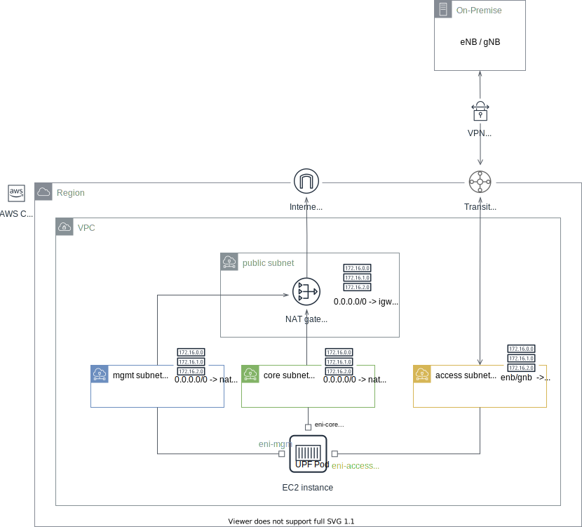

<!--
SPDX-License-Identifier: Apache-2.0
Copyright 2021 Open Networking Foundation
-->
# Running UPF on EC2

This guide walks you through how to set up and configure EC2 to run BESS UPF.

**Contents**
- Overview
- Step 1: VPC prerequisites
- Step 2: Launch an instance
- Step 3: Set up OS
- Step 4: Set up K8S
- Step 5: Install BESS-UPF

Before you begin, be sure that you've completed the steps in
[Set up to use Amazon EC2](https://docs.aws.amazon.com/AWSEC2/latest/UserGuide/get-set-up-for-amazon-ec2.html).

#### Overview

The following diagram illustrates an example deployment architecture. To help
your understanding, this example be used in the rest of the guide.




#### Step 1: VPC prerequisites

Create a VPC network and three subnets, `mgmt`, `access` and `core` and make the
`mgmt` and `core` subnets accessible to the Internet. There are several ways to
achieve this, but in the example deployment, we added a separate public subnet
containing a NAT gateway and configured route table for the two subnets to the
NAT gateway. If you have eNB or gNB in your on-premise, configure routes for it
in the `access` subnet route table.

After you've created the subnets and configured routes, create one network
interface (ENI) for each `access` and `core` subnets. Also, disable
source/destination check for the `core` subnet ENI. Lastly, add a route for the
UE pool subnet to the public subnet's route table with the `core` subnet ENI as
the destination.

#### Step 2: Launch an instance

Create an instance with Elastic Network Adapter (ENA) support, which is enabled
in most of the instance types by default. To learn more about ENA, visit
[this site](https://docs.aws.amazon.com/AWSEC2/latest/UserGuide/enhanced-networking-ena.html).

Here is the most tested instance settings.
* Type: c5.2xlarge
* AMI: Ubuntu 20.04 HVM

When you create a VM, attach the `mgmt` subnet only, and after the VM is
provisioned successfully, attach `access` and `core` subnet ENIs created in the
previous step in order.

#### Step 3: Set up OS

SSH into the VM and update Grub to enable 1Gi HugePages.

```
$ sudo vi /etc/default/grub
# Edit grub command line
GRUB_CMDLINE_LINUX="transparent_hugepage=never default_hugepagesz=1G hugepagesz=1G hugepages=2"

$ sudo update-grub
```

Load vfio-pci driver and enable unsafe IOMMU.
```
sudo su -
modprobe vfio-pci
echo "options vfio enable_unsafe_noiommu_mode=1" > /etc/modprobe.d/vfio-noiommu.conf
echo "vfio-pci" > /etc/modules-load.d/vfio-pci.conf
reboot
```

After the reboot, verify the changes.
```
$ cat /proc/meminfo | grep Huge
AnonHugePages:         0 kB
ShmemHugePages:        0 kB
FileHugePages:         0 kB
HugePages_Total:       2
HugePages_Free:        2
HugePages_Rsvd:        0
HugePages_Surp:        0
Hugepagesize:    1048576 kB
Hugetlb:         4194304 kB

$ cat /sys/module/vfio/parameters/enable_unsafe_noiommu_mode
Y
```

Lastly, bind `access` and `core` interfaces to vfio driver.
Before proceeding, take note of MAC addresses of the two ENIs specified in EC2
dashboard or in the `aws ec2 describe-network-interfaces` result. They are
required to find PCI address of the interfaces.

```
# Find interface name of the access and core subnet ENIs by comparing the MAC address
$ ip link show ens6
$ ip link show ens7

# Find PCI address of the access and core subnet ENIs
$ lshw -c network -businfo
Bus info          Device           Class      Description
=========================================================
pci@0000:00:05.0  ens5             network    Elastic Network Adapter (ENA)
pci@0000:00:06.0  ens6             network    Elastic Network Adapter (ENA) # access in this example
pci@0000:00:07.0  ens7             network    Elastic Network Adapter (ENA) # core in this example

# Install driverctl
$ sudo apt update
$ sudo apt install driverctl

# Check current driver
$ sudo driverctl -v list-devices | grep -i net
0000:00:05.0 ena (Elastic Network Adapter (ENA))
0000:00:06.0 ena (Elastic Network Adapter (ENA))
0000:00:07.0 ena (Elastic Network Adapter (ENA))

# Bind access and core interfaces to vfio-pci driver
$ sudo driverctl set-override 0000:00:06.0 vfio-pci
$ sudo driverctl set-override 0000:00:07.0 vfio-pci

# Verify
$ sudo driverctl -v list-devices | grep -i net
0000:00:05.0 ena (Elastic Network Adapter (ENA))
0000:00:06.0 vfio-pci [*] (Elastic Network Adapter (ENA))
0000:00:07.0 vfio-pci [*] (Elastic Network Adapter (ENA))

$ ls -l /dev/vfio/
crw------- 1 root root 242,   0 Aug 17 22:15 noiommu-0
crw------- 1 root root 242,   1 Aug 17 22:16 noiommu-1
crw-rw-rw- 1 root root  10, 196 Aug 17 21:51 vfio
```

#### Step 4: Set up K8S

How to install K8S is beyond the scope of this guide. Once K8S is ready on the
VM, you'll need to install `Multus` and `sriov-device-plugin`.

```
# Install Multus
kubectl apply -f https://raw.githubusercontent.com/k8snetworkplumbingwg/multus-cni/release-3.7/images/multus-daemonset.yml

# Verify
$ kubectl get ds -n kube-system kube-multus-ds
NAME             DESIRED   CURRENT   READY   UP-TO-DATE   AVAILABLE
kube-multus-ds   1         1         1       1            1

# Create sriov device plugin config
# Replace PCI address if necessary
cat <<EOF | kubectl apply -f -
apiVersion: v1
kind: ConfigMap
metadata:
  name: sriovdp-config
data:
  config.json: |
    {
      "resourceList": [
        {
          "resourceName": "intel_sriov_vfio_access",
          "selectors": {
            "pciAddresses": ["0000:00:06.0"]
          }
        },
        {
          "resourceName": "intel_sriov_vfio_core",
          "selectors": {
            "pciAddresses": ["0000:00:07.0"]
          }
        }
      ]
    }
EOF

# Create sriov device plugin DaemonSet
kubectl apply -f https://raw.githubusercontent.com/k8snetworkplumbingwg/sriov-network-device-plugin/v3.3/deployments/k8s-v1.16/sriovdp-daemonset.yaml

# Verify
$ kubectl get ds -n kube-system kube-sriov-device-plugin-amd64
NAME                             DESIRED   CURRENT   READY   UP-TO-DATE   AVAILABLE
kube-sriov-device-plugin-amd64   1         1         1       1            1
```

Check the allocatable resources in the node. Make sure there are 2 1Gi HugePages,
1 `intel_sriov_vfio_access` and 1 `intel_sriov_vfio_core`.
```
$ kubectl get node  -o json | jq '.items[].status.allocatable'
{
  "attachable-volumes-aws-ebs": "25",
  "cpu": "7",
  "ephemeral-storage": "46779129369",
  "hugepages-1Gi": "2Gi",
  "hugepages-2Mi": "0",
  "intel.com/intel_sriov_vfio_access": "1",
  "intel.com/intel_sriov_vfio_core": "1",
  "memory": "13198484Ki",
  "pods": "110"
}
```

Lastly, copy `vfioveth` CNI under `/opt/cni/bin` on the VM.
```
sudo wget -O /opt/cni/bin/vfioveth https://raw.githubusercontent.com/opencord/omec-cni/master/vfioveth
sudo chmod +x /opt/cni/bin/vfioveth
```

#### Step 5: Install BESS-UPF

BESS UPF helm chart is currently under the ONF members only license. If you
already have an access to the helm chart, provide the following overriding
values when deploying the chart. Don't forget to replace IP addresses and MAC
addresses properly.

```
$ cat >> overriding-values.yaml << EOF
config:
  upf:
    privileged: true
    enb:
      subnet: "10.22.0.128/26"
    access:
      ip: "172.31.67.192/24"
      gateway: "172.31.67.1"
      mac: "02:ee:e9:c8:a5:31"
      resourceName: "intel.com/intel_sriov_vfio_access"
    core:
      ip: "172.31.68.136/24"
      gateway: "172.31.68.1"
      mac: "02:67:74:80:be:35"
      resourceName: "intel.com/intel_sriov_vfio_core"
EOF

$ helm install -n bess-upf bess-upf [path/to/helm/chart] -f overriding-values.yaml
$ kubectl get po -n bess-upf
NAME    READY   STATUS    RESTARTS   AGE
upf-0   4/4     Running   0          41h
```