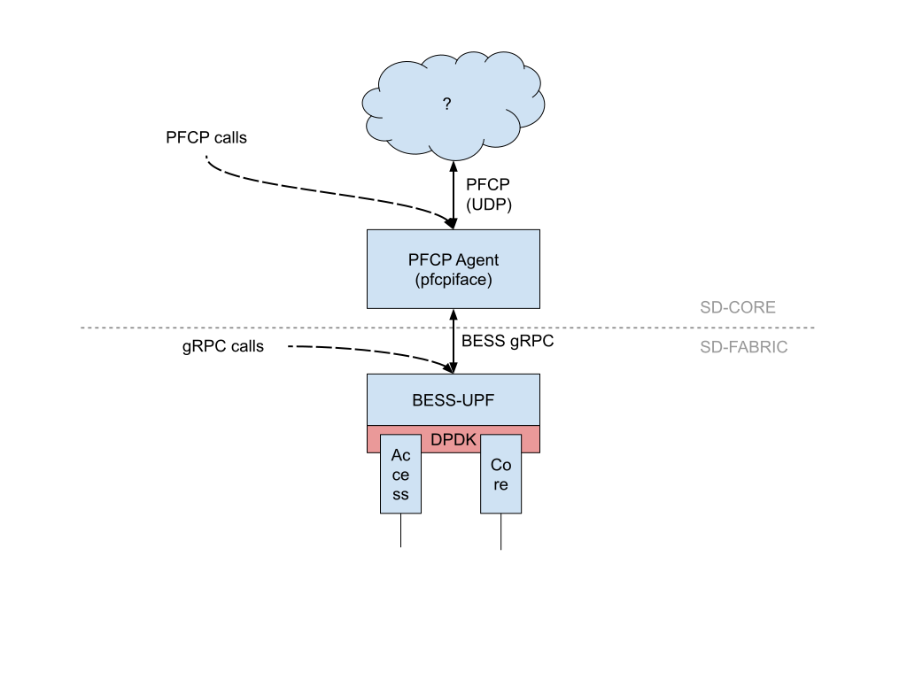
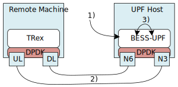

<!-- SPDX-License-Identifier: Apache-2.0 -->
<!-- Copyright 2021 Open Networking Foundation -->
# PTF tests for BESS-UPF

## Overview

The aim of implementing a test framework for UPF is to create a
developer-friendly infrastructure for creating either single-packet or
high-speed tests that assess UPF features at a component level.

This "component-level" is achieved by *bypassing* calls to the PFCP
agent, in favor of communicating with BESS directly via gRPC.



This figure illustrates two options for communicating with the UPF.  In
this framework, we opt for **BESS gRPC calls** instead of calls to the PFCP
agent because they allow direct communication between the framework and
the BESS instance for both installing rules and reading metrics.

## Workflow
Tests require two separate machines to run, since both TRex and UPF
use DPDK. Currently, the test workflow is as such:



In **step 1**, rules are installed onto the UPF instance by the test
framework via BESS gRPC messages.

In **step 2**, TRex or Scapy (depending on the type of test case)
generates traffic to the UPF across NICs and physical links.

In **step 3**, traffic routes through the UPF and back to the machine
hosting TRex, where results are asserted.

## Required Tools/Components
* [PTF](https://github.com/p4lang/PTF) (Packet Testing Framework): a
data plane testing framework written in Python
* [TRex](https://github.com/cisco-system-traffic-generator/trex-core): a
high-speed traffic generator built on top of DPDK, containing a Python API

## Directory Structure
### config
This directory contains YAML config file definition for TRex along with
other personalized config files
### lib
This directory contains general purpose libraries and classes to be imported in
PTF test definitions
### tests
This directory contains all of the test case definitions (written in Python), as
well as scripts for running them in a test environment. We currently provide two
general types of test cases:
* `unary`: tests are *single packet* tests that assess UPF performance in
specific scenarios. Packets are crafted and sent to the UPF using the `Scapy`
packet library.
  > *Example*: a unary test could use Scapy to send a single non-encapsulated
  UDP packet to the core interface of the UPF, and assert that a
  GTP-encapsulated packet was received from the access interface
* `linerate`: tests assess the UPF's performance in certain scenarios
at high speeds. This allows UPF features to be verified that they perform as
expected in an environment more representative of *production level*. Traffic is
generated using the [TRex Python API](https://github.com/cisco-system-traffic-generator/trex-core/blob/master/doc/trex_cookbook.asciidoc).
  > *Example*: a line rate test could assert the baseline throughput, latency,
  etc. of the UPF is as expected when handling high-speed downlink traffic from
  10,000 unique UEs

## Run tests
The run script assumes that the TRex daemon server and the UPF
instance are already running on their respective machines. Please see
[here](../docs/INSTALL.md#configuration-dpdk-mode) for instructions to deploy
the UPF in DPDK mode. Note that the following additional changes are required
in the `conf/upf.jsonc` file: `"measure_flow": true`, N3 interface set to
`"ifname": "access"` and N6 interface set to `"ifname": "core"`.
To install TRex onto your server, please refer to the
[TRex installation guide](https://trex-tgn.cisco.com/trex/doc/trex_manual.html#_download_and_installation)

### Steps
1. Update the following files accordingly to route traffic to the UPF and vice versa.
* `ptf/.env` file updated with `UPF_ADDR` and `TREX_ADDR` parameters
* `ptf/config/trex-cfg-for-ptf.yaml` file updated with proper values for
  `interfaces`, `port_info`, and `platform` parameters
* `ptf/tests/linerate/common.py` file updated with proper MAC address values for
  `TREX_SRC_MAC`, `UPF_CORE_MAC`, and `UPF_ACCESS_MAC`

2. Move into the `ptf` directory
```bash
cd ptf
```

3. Generate BESS Python protobuf files for gRPC library and PTF Dockerfile image
   build dependencies:
```bash
make build
```

4. Run PTF tests using the `run_tests` script:
```bash
./run_tests -t [test-dir] [optional: filename/filename.test_case]
```

### Examples
To run all test cases in the `unary/` directory:
```bash
./run_tests -t tests/unary
```
To run a specific test case:
```bash
./run_tests -t tests/linerate/ baseline.DownlinkPerformanceBaselineTest
./run_tests -t tests/linerate/ mbr
./run_tests -t tests/linerate/ qos_metrics
```
Note: If the above fails, `sudo` may be needed
