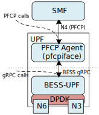

# PTF tests for BESS-UPF

## Tools
* [PTF](https://github.com/p4lang/PTF): "Packet Testing Framework"; a
data plane testing framework written in Python
* [TRex](https://github.com/cisco-system-traffic-generator/trex-core): a
high-speed traffic generator on top of DPDK with a Python API

## Overview

The aim of implementing tests for UPF-EPC is to create a
developer-friendly test infrastructure for both single-packet and high
speed tests, that assess UPF features at a component level. This
"component-level" is achieved by bypassing calls to the pfcp agent, in
favor of communicating with BESS directly via gRPC.



This figure illustrates the two options for implementing communication
with the UPF. In this framework, we opt for **gRPC calls**, allowing
communication for both rule installation and metrics reads to be
directly between the framework and BESS instance.

## Structure
* `tests/`: all PTF test definitions in Python
    * `unary/`: single-packet tests for specific scenarios
    * `linerate/`: high-speed tests via TRex
* `lib/`: general purpose libraries and classes to be imported
in PTF test definitions
* `trex-config/`: contains YAML config file definition for TRex 

**Unary** tests are *single packet* tests that assess UPF
performance in specific scenarios. Packets are crafted and sent to the
UPF using the Scapy packet library.

For example, a unary test could send a single unencapsulated packet to
the core interface of the UPF, and assert that a GTP-encapsulated packet
was received from the access interface.

**Linerate** tests assess the UPF's performance in certain scenarios at
*high speeds*.  This allows UPF features to be verified that they
perform as expected in an environment more representative of *production
level*.

For example, a linerate test could test the performance of the UPF when
interacting with downlink traffic from 10,000 unique UEs.


## Workflow
Tests require two separate machines to run, since both TRex and UPF-EPC
use DPDK. Test workflow is as such:


In **step 1**, rules are installed onto UPF-EPC via BESS gRPC messages
from the test framework.

In **step 2**, TRex/Scapy generates traffic to the UPF across NICs.

In **step 3**, traffic routes through the UPF and back to the machine hosting TRex, where results are asserted.

## Steps to run tests
The run script assumes that the TRex DPDK daemon server and UPF-EPC are
already running on their respective machines. It also assumes that the
TRex config file in `trex-config/` has been configured correctly to
route traffic to the UPF.

To install TRex onto your server, please refer to the [TRex installation
guide](https://trex-tgn.cisco.com/trex/doc/trex_manual.html#_download_and_installation)

### Steps
1. In `/upf-epc/`, generate proto files in Python for BESS gRPC
communication
```console
make py-pb
cd ptf
```
2. Build dependencies for the PTF test image
```console
make build
```
3. Run PTF tests using the `run_tests` script:
```console
./run_tests -t [test-dir] [optional: filename/filename.test_case]
```
To run all test cases in the `unary/` directory:
```console
./run_tests -t tests/unary
```
To run a specific test case:
```console
./run_tests -t tests/linerate/ baseline.DownlinkPerformanceBaselineTest
```
